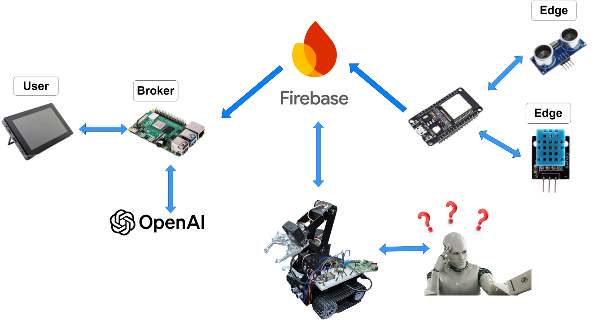
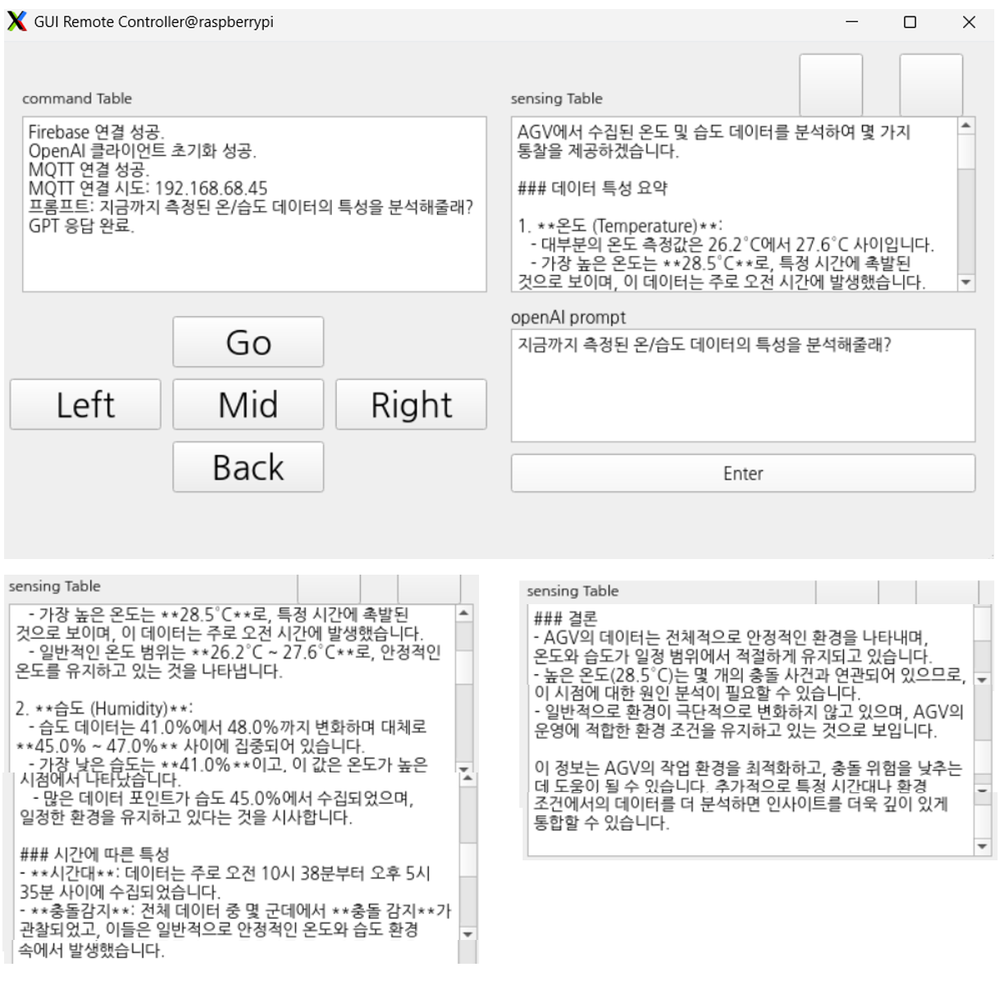

# 🧢 센서 융합 및 AI 기반 자율주행 AGV 시스템 개발


## 📌 프로젝트 개요

이 프로젝트는 **Jetson Nano 기반 자율주행 AGV(무인운반차)** 와 **PySide2 기반 원격 GUI 관리자**가 연동되어, 다음과 같은 복합 기능을 수행합니다:

* 🌟 **자율주행 제어** (ResNet18 기반 딥러닝 모델 사용)
* 🌡️ **센서 정보 실시간 수집** (온도, 속도, 거리)
* 🎨 **색상 기반 목표 구역 인식**
* 📡 **MQTT 양방향 통신 제어**
* 🔎 **Firebase Real-Time DB, Firestore DB에 로그 저장**
* 🤖 **OpenAI GPT와 연동하여 분석 및 시각화**

---

## 🧠 시스템 아키텍처

```
Jetson Nano (AGV)
도구
├── 카메라 실시간 사용
├── 자율주행 제어 (ResNet18 기반)
├── 색상 감지 (HSV 구현)
├── 센서 값 RTDB 수집
├── 충돌 여부 조회 (30cm 이하)
├── Firestore 로그 저장
├── MQTT 메시지 subscribe (Start/Stop)
└── MQTT 데이터 게시
      │
      ▼
[MQTT 브로커]
      │
      ▼
관리자 PC (manager_gui.py)
├── MQTT subscribe → 실시간 JSON 보여주기
├── 명령 발사 (go/stop/back/...)
├── Firestore 로그 조회
├── GPT 문자 입력 및 분석
├── GPT 시각화 코드 생성
└── matplotlib → GUI 창에 표시
```



---

## 💡 주요 기능

### 📍 Jetson Nano (`agv_controller.py`)

* **자율주행**: ResNet18 기반 이미지 입력 → xy steering 예측
* **색상 인식**: HSV 커널 검색 (red, blue, purple, yellow, orange)
* **센서 수집**: Firebase RTDB에서 실시간 값 fetch
* **충돌 조회**: 30cm 이하에서 정지
* **Firestore 로그**: 실시간 + 센서 값 + 충돌 여부 등 저장
* **MQTT 메시지 subscribe**: 가지고 버튼 통해 반응
* **Jupyter UI**: 사용자 연동 컨트롤 (슬라이더 + 영상)

### 🖥️ 관리자 GUI (`agv_dashboard.py`)

* **PySide2 기반 GUI**: Firestore 로그 뷰 + 센서 상태 실시간 표시
* **제어 버튼**: go, stop, back, left, right 등 MQTT 명령 전송
* **GPT 분석 기능**:

  * 자유로운 프롬프트 입력 → AGV 로그 기반 답변 생성
  * GPT가 직접 matplotlib 시각화 코드 생성
* **시각화**: QPixmap으로 차트 이미지 창에 출력

---

## 📡 MQTT 토픽

| 구분     | 토픽 이름                | 설명                 |
| ------ | -------------------- | ------------------ |
| 명령어    | `YOUR_COMMAND_TOPIC` | go, stop 등 명령어 송신용 |
| 상태 데이터 | `YOUR_SENSING_TOPIC` | AGV 상태/센서 데이터 수신용  |

> 실제 사용 시에는 YOUR\_... 부분을 환경에 맞게 수정하세요.

---

## 🧾 Firestore 데이터 예시

```json
{
  "time": "2025-07-01 14:33:10",
  "temperature": 35.4,
  "humidity": 60.1,
  "is_collision_detected": false
}
```

---

## ⚙️ 실행 환경

### AGV (Jetson Nano)

* `torch`, `torchvision`
* `opencv-python`, `ipywidgets`, `traitlets`
* `firebase-admin`, `paho-mqtt`

### 관리자 GUI (PC)

* `PySide2`, `pandas`, `matplotlib`
* `firebase-admin`, `paho-mqtt`, `openai`
* `NanumGothic` 폰트 (차트용 한글 표시)
* `ui_form.py` (Qt Designer로 만든 `.ui` → `.py` 변환 필요)


## ✨ 핵심 기술

* **AI + IoT 융합**: JetBot + Firebase + MQTT + OpenAI
* **데이터 중심 제어**: 로그 기반의 분석/통찰 제공
* **시각화 통합**: 관리자 GUI에서 누적 Data 기반 실시간 GPT 분석 요청 가능
* **관리자 제어**: 관리자 측 실시간 영상 스트리밍, 휴리스틱 제어 기능

---

## 🔮 향후 발전 방향

* 장애물 우회 경로 생성 알고리즘 추가
* GPT 프롬프트 자동화 / 이벤트 알림 기능

---

## 🖼️ 스크린샷 예시

| AGV 제어 UI                      |
| ------------------------------ |
|  |
|  |

| 구동부 - 긴급 제동                |
| ------------------------------ |
|  |

| 구동부 - Lane Tracking           |
| ------------------------------ |
|  |
---
